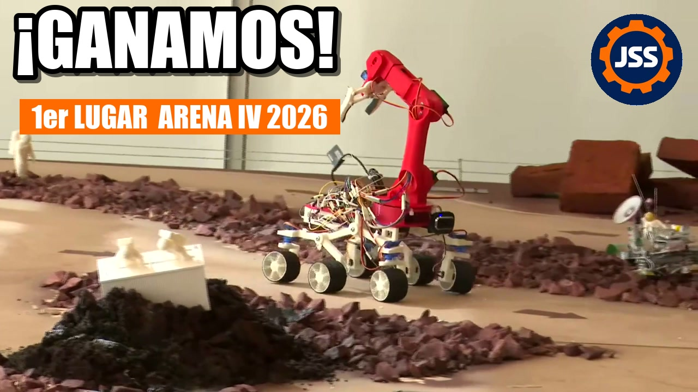
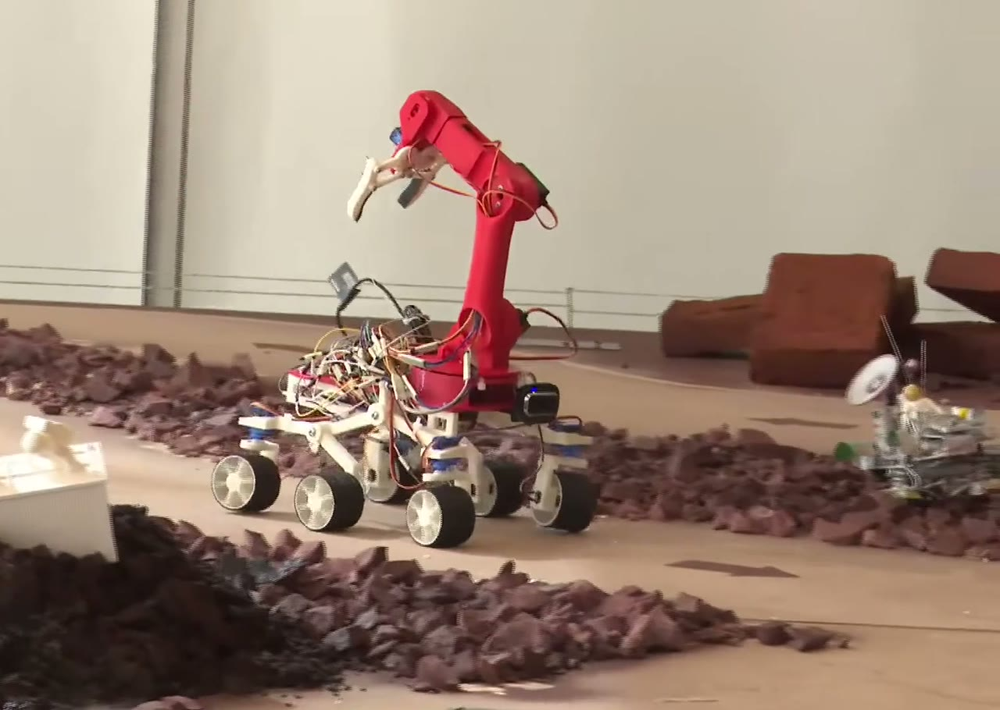
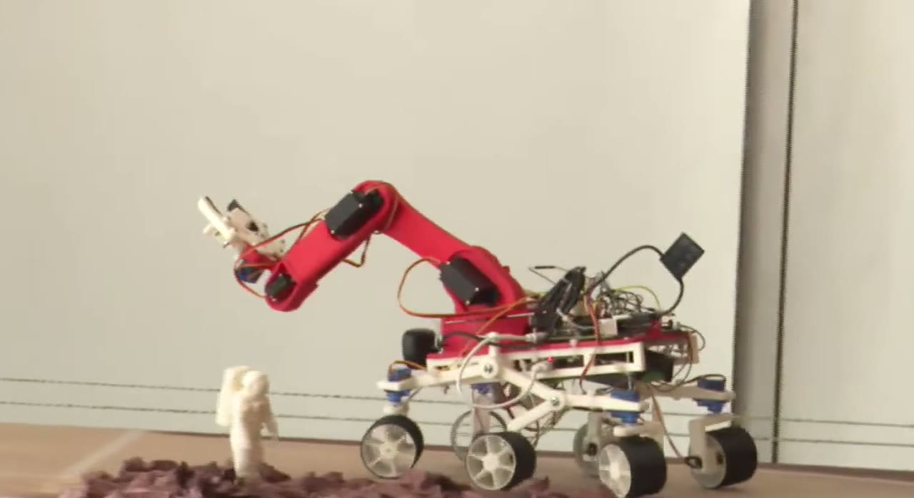
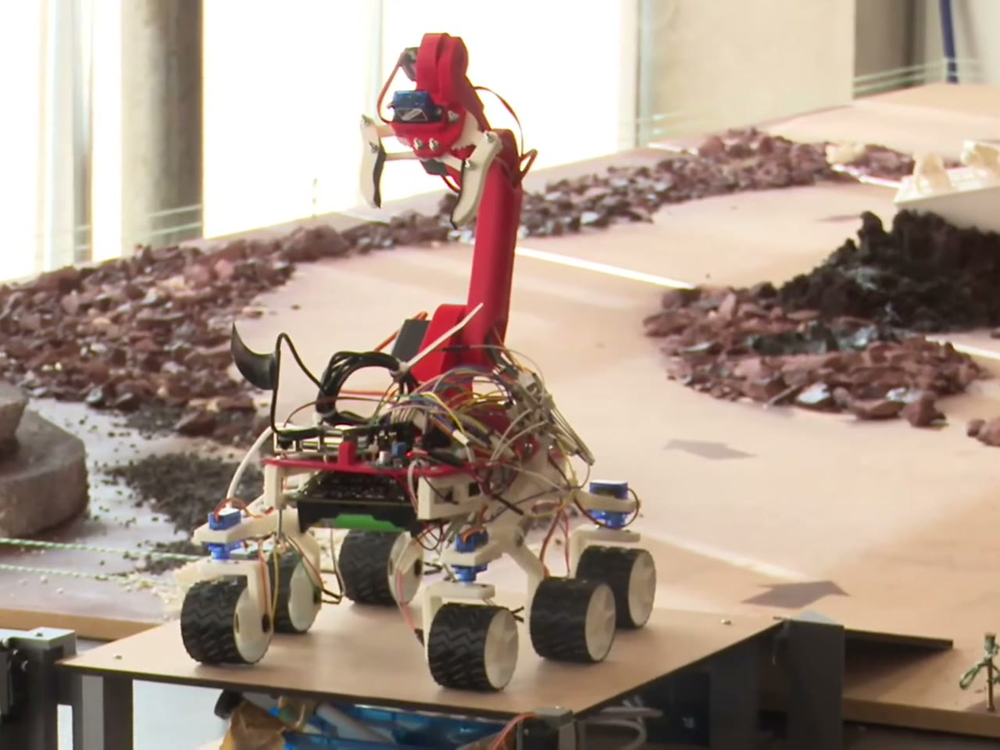

# Rover Percy

🏆 **1er lugar — Torneo Arena IV 2026, Duoc UC** (Desafío de Innovación
CITT-2026, Misión EREBUS-I: Exploración Planetaria).

👥 **Equipo:** Pamela Alvarez y Juan Salas

## 📺 Mira el video

<p align="center">
  <a href="https://youtu.be/7GjuUFy00kE">
    
  </a>
  <br>
  <sub><a href="https://youtu.be/7GjuUFy00kE">Ver en YouTube</a>: Percy en la pista y la premiación.
  Transmisión completa del torneo en el
  <a href="https://www.youtube.com/watch?v=aI01HbEa-U4">canal de Duoc UC</a>.</sub>
</p>

---

## En pocas palabras

Percy es un robot explorador de 6 ruedas inspirado en el rover
*Perseverance* de la NASA. En la competencia tenía que cruzar una pista
de 4×4 m con arena, gravilla y rocas que simula la superficie de Marte,
**recoger muestras con su brazo robótico** y llevarlas a una zona de
depósito, todo en menos de 10 minutos.

<p align="center">
  
</p>

Se maneja **desde el celular**, sin instalar ninguna aplicación: el
robot crea su propia red WiFi, uno se conecta y abre una página web con
dos joysticks táctiles, uno para conducir y otro para mover el brazo.

<p align="center">
  
  <br>
  <sub>El panel de control en el celular (horizontal). Joystick izquierdo: tracción. Joystick derecho: punta de la garra. Al centro, los ejes del brazo, la garra y el depósito. El video de la cámara va de fondo.</sub>
</p>

Casi todo el robot está **impreso en 3D**: ruedas, suspensión, chasis y
brazo.

## ¿Cómo funciona?

| Parte | Qué hace |
|---|---|
| **Suspensión rocker-bogie** | El mismo sistema de los rovers reales de Marte: las ruedas suben y bajan por separado, así el robot pasa sobre rocas sin volcarse. |
| **Chasis rediseñado y alargado** | El Percy original no tenía brazo. Alargamos el chasis cerca de un 50% (de 14 a 21 cm) para que el brazo quepa arriba sin desequilibrar el rover, y diseñamos una base nueva que une los dos costados del chasis y sostiene el brazo. |
| **6 ruedas con motor** | Las 6 ruedas empujan, y las 4 de las esquinas además giran para doblar (ver "¿Cómo se desplaza?" abajo). |
| **Brazo robótico con garra** | Gira, sube, baja y se estira para tomar muestras, y las lleva sujetas en la garra hasta la zona de depósito. El operador mueve la punta de la garra con el joystick y el robot calcula solo cómo mover cada articulación. |
| **Computador a bordo** | Una Orange Pi 3B (similar a una Raspberry Pi) recibe las órdenes del celular y controla todos los motores. |
| **Dos baterías separadas** | Una para el computador y otra para los motores, para que un tirón de corriente de los motores no reinicie el computador en plena misión. |

<p align="center">
  
  
</p>

## ¿Cómo se desplaza?

Cada una de las 6 ruedas tiene su propio motor, y las 4 de las esquinas
tienen además un pequeño servo que las hace girar, como el volante de
un auto pero en las dos puntas del robot. Con el joystick izquierdo se
acelera, se frena y se dobla, y un botón del celular cambia entre tres
formas de manejar:

| Modo | Cómo dobla | Para qué sirve |
|---|---|---|
| **Combinado** (el normal) | Gira las ruedas de las esquinas y además hace que un lado avance más rápido que el otro | Uso general: dobla cerrado y firme |
| **Vehículo** | Solo gira las ruedas, como un auto | Arena suelta: las ruedas no se arrastran de costado |
| **Tanque** | Pone las 4 ruedas de las esquinas en diagonal y hace girar cada lado hacia un sentido opuesto | Girar sobre su propio eje sin avanzar, para acomodarse frente a una muestra en poco espacio |

También hay tres velocidades (lenta, media y rápida): la lenta sirve
para acercarse con precisión a una muestra y la rápida para cruzar la
pista.

## Extras de innovación
- El celular **vibra** al agarrar una muestra o cuando el brazo llega a
  su límite.
- **Grabar y reproducir posiciones del brazo:** el operador deja el
  brazo en una posición (por ejemplo, "lista para tomar" o "traslado"),
  la graba con un nombre desde el celular, y después el
  brazo vuelve a ella solo, con un movimiento suave, apretando un botón.
  Ahorra tiempo en las maniobras que se repiten en cada viaje.
- Prototipo de **control por voz** que funciona sin internet, dentro
  del mismo navegador.

---

## Detalle técnico

### Arquitectura

```
Celular (navegador) --WebSocket /ws--> FastAPI (Orange Pi 3B)
                                          |-- I2C  --> PCA9685 --> 10 servos (brazo, garra, steering)
                                          '-- GPIO --> 2x TB6612FNG --> 6 motores N20 (tracción)
```

- **Cómputo:** Orange Pi 3B (RK3566, 4GB) con Ubuntu 22.04 oficial,
  Python + FastAPI + WebSocket. El dashboard es HTML/JS plano, sin
  dependencias externas (en pista no hay internet).
- **Red:** se conecta a redes WiFi conocidas o, si no encuentra
  ninguna, levanta su propia red. Accesible también como `percy.local`.
- **Chasis:** los `side_chassis` originales de BricoLabs (140 mm) se
  reemplazaron por `chasis_largo` (211 mm, ~50% más largos) para ganar
  espacio para el brazo y la electrónica. El brazo se integra con una
  base propia (`base_brazo`, 120×217 mm) que se atornilla sobre los dos
  largueros y reemplaza la `Base.STL` del tutorial; la cintura (`Waist`)
  y el servo de giro se montan encima sin cambios. Piezas en
  `3dprint/stl/rover_perceverance/canasta - chasis nuevo/`.
- **Brazo:** piezas originales del
  [HowToMechatronics](https://howtomechatronics.com/tutorials/arduino/diy-arduino-robot-arm-with-smartphone-control/),
  sin rediseñar, montadas sobre una base propia atornillada al chasis.
  3 servos MG996R (base, hombro, codo) + 1 SG90S con engranajes
  metálicos (inclinación de muñeca) + 2 MG90S (giro y cierre de garra).
  Hombro, codo e inclinación se controlan por cinemática inversa de 3
  juntas acopladas: el joystick mueve la punta de la garra en línea
  recta, no articulación por articulación. También tiene un modo libre
  (articulación por articulación) para calibrar.
- **Presets del brazo:** se graban desde el dashboard con nombre
  (`preset_save`), se reproducen (`preset_goto`) y se borran
  (`preset_delete`) por el mismo WebSocket. Guardan el ángulo final de
  los 5 servos del brazo en `presets.json`, no el trayecto. Al
  reproducirlos, el brazo rampea a 60°/s desde donde esté hasta la pose
  guardada.
- **Dirección:** 4 servos SG90 en las esquinas (±35° en manejo normal),
  con las traseras girando al revés que las delanteras para cerrar el
  radio de giro. 3 modos seleccionables (`drive_mode`): combinado
  (dirección + diferencial entre lados), vehículo (solo dirección) y
  tanque (pivote de radio cero real: ruedas en rombo a 52,5°, ángulo
  calculado de la trocha de 18 cm y la distancia entre ejes de 23,5 cm,
  más diferencial en sentidos opuestos). 3 niveles de velocidad (45%,
  65% y 100% del PWM máximo).
- **Tracción:** 6 motores N20 (1:150) vía 2 puentes H TB6612FNG
  (4 canales, con motores en paralelo por lado), con señal de dirección
  por GPIO y PWM de velocidad por canales libres del PCA9685 (no por los
  2 únicos PWM de hardware de la Orange Pi).
- **Alimentación:** rail de cómputo aislado (2×18650 → módulo 5V USB)
  separado del rail de actuadores (3×18650 → LM2596 → 6V, servos +
  motores), con un interlock por software que corta la tracción
  mientras el brazo se mueve, por el presupuesto de corriente compartido.
- **Control por voz:** Vosk compilado a WebAssembly, 100% en el
  navegador y con gramática cerrada para resistir el ruido de pista.
  Probado offline en PC; en el celular requiere servir el dashboard por
  HTTPS.

### Documentación

- **[`orangepi/README.md`](orangepi/README.md):** protocolo WebSocket,
  tabla de pines y cableado, calibración del brazo, endpoints REST,
  instalación y estructura del código. Incluye una guía de uso del panel
  de control.
- **[`orangepi/voice_models/README.md`](orangepi/voice_models/README.md):**
  cómo generar el modelo de voz para el control por voz.

### Estructura del repo

```
orangepi/       backend (FastAPI, servos, motores, dashboard) - ver su README
3dprint/        piezas STL/gcode del chasis, brazo y ruedas
img/            fotos y capturas usadas en este README
```

## Créditos

- Base mecánica adaptada de [Percy de BricoLabs](https://github.com/felixstdp/Perseverance)
  (rocker-bogie 1:10).
- Brazo del tutorial [DIY Arduino Robot Arm de HowToMechatronics](https://howtomechatronics.com/tutorials/arduino/diy-arduino-robot-arm-with-smartphone-control/).
- Electrónica, software de control y dashboard propios.
- Fotos del rover: fotogramas de la [transmisión oficial de Duoc UC](https://www.youtube.com/watch?v=aI01HbEa-U4)
  del Torneo Arena IV 2026.
