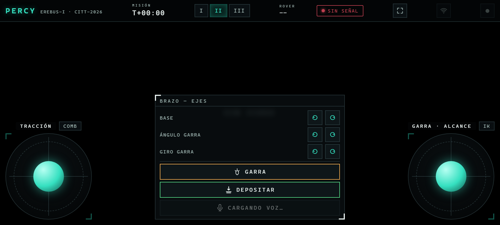

# Percy — software de control (Orange Pi 3B)

Esta carpeta es el "cerebro" del rover: el programa que corre en la
Orange Pi y la página web que se abre en el celular para manejarlo. Ver
el [README principal](../README.md) para el contexto del proyecto
(concurso, mecánica, hardware).

## En pocas palabras

- El rover lleva a bordo una **Orange Pi 3B**, un computador del tamaño
  de una tarjeta de crédito (parecido a una Raspberry Pi).
- En ella corre un **servidor web**. Cuando uno abre esa página en el
  celular, aparece un panel de control con joysticks táctiles.
- Cada movimiento del joystick viaja por WiFi al rover unas 20 veces por
  segundo, y la Orange Pi lo convierte en órdenes para los motores de
  las ruedas y los servos del brazo.
- No hace falta instalar ninguna aplicación ni tener internet: basta con
  el navegador del celular.

## Cómo se usa

1. **Encender el rover.** El programa arranca solo; no hay que hacer nada
   más.
2. **Conectar el celular al rover.**
   - En casa, el rover se conecta a las redes WiFi que tenga guardadas.
   - En cualquier otro lugar, si en ~1 minuto no encuentra una red
     conocida, crea su **propia red WiFi, `PercyRover`**.
3. **Abrir el panel** en el navegador del celular:
   - Con la red propia: `http://10.42.0.1:8000`
   - En otra red: `http://percy.local:8000`, o la IP que muestra el aviso
     del rover (ver "WiFi" más abajo).
4. **Poner el celular en horizontal** y manejar con los dos pulgares.

<p align="center">
  
</p>

| Control | Qué hace |
|---|---|
| **Joystick izquierdo** (TRACCIÓN) | Avanza, retrocede y dobla |
| Botón **COMB** junto al joystick izquierdo | Cambia el modo de manejo: combinado, vehículo o tanque (girar en el lugar) |
| **I / II / III** (arriba) | Velocidad lenta, media o rápida |
| **Joystick derecho** (GARRA · ALCANCE) | Mueve la punta de la garra: arriba/abajo y adelante/atrás |
| Botón **IK / LIBRE** junto al joystick derecho | IK: la garra se mueve en línea recta. LIBRE: cada articulación por separado |
| **BASE** | Gira todo el brazo a la izquierda o derecha |
| **ÁNGULO GARRA** | Inclina la garra hacia arriba o abajo |
| **GIRO GARRA** | Gira la garra sobre sí misma |
| **GARRA** | Abre o cierra la garra |
| **DEPOSITAR** | Lleva el brazo a la posición de soltar, abre la garra y vuelve |
| **Micrófono** (VOZ) | Mantener apretado y decir un comando (ver "Control por voz") |
| Ícono de **grabar** (arriba) | Guardar la posición actual del brazo con un nombre, o volver a una guardada |
| Ícono de **WiFi** (arriba) | Ver y cambiar la red del rover |

El celular **vibra** al abrir o cerrar la garra, al depositar y cuando el
brazo llega a su límite.

**Consejos:**
- **Un solo celular conectado a la vez.** Si hay dos, se pisan las
  órdenes (el que está quieto manda "parar").
- **Apagar bien:** `sudo poweroff`, no cortar la batería de golpe. La
  tarjeta SD guarda con retraso y un corte puede perder cambios
  recientes.
- **Cablear siempre con las dos baterías desconectadas.**

---

## Detalle técnico

### Instalación en la Orange Pi

Probado con **Ubuntu 22.04 Server**, imagen oficial de orangepi.org para
la 3B.

```bash
# copiar la carpeta completa a la Orange Pi (desde el PC, con pscp/scp)
pscp -r orangepi orangepi@<ip-orange-pi>:/home/orangepi/percy

# en la Orange Pi
cd ~/percy
pip3 install --user -r requirements.txt   # ver nota en requirements.txt:
                                           # NO instala opencv/gpiod (ya son del sistema)
sudo sh wifi/install.sh                    # gestor WiFi + red propia (ver "WiFi")
```

Después de copiar archivos, correr `sync` antes de apagar.

**Arranque automático (systemd).** El servidor corre como servicio
(`/etc/systemd/system/percy.service`, copia en `percy.service`) y
arranca solo en cada reinicio:

```bash
sudo systemctl status percy.service   # ver estado
sudo systemctl restart percy.service  # reiniciar tras un cambio de codigo
sudo journalctl -u percy.service -f   # ver logs en vivo
```

Tras copiar código nuevo hay que reiniciar el servicio. No lanzar
`python3 main.py` a mano: quedaría un segundo proceso compitiendo por el
puerto 8000.

### Arquitectura y protocolo

```
Celular (navegador) --WebSocket /ws--> FastAPI (main.py)
                                          |-- I2C --> PCA9685 --> 10 servos + PWM de motores (ch10-15)
                                          |                       (brazo x4, giro garra, garra, steering x4)
                                          '-- GPIO --> 2x TB6612FNG --> 6 motores N20 (en paralelo por lado)
```

El dashboard manda ~20 mensajes/seg por WebSocket con el estado completo
de joysticks/botones (no solo cambios). `main.py:_apply_command` traduce
cada mensaje a servos/motores; el servidor responde con un eco liviano
(`{"hit_limit": bool}`) que el dashboard usa para el feedback háptico.

### Tracción — 3 modos (botón de modo del dashboard, `drive_mode`)

| Modo | Cómo gira | Cuándo conviene |
|---|---|---|
| `combinado` (default) | Las 4 ruedas de esquina giran proporcional a `lx` **y** además hay diferencial de velocidad entre lados con el mismo `lx` | Uso general |
| `vehiculo` | Solo dirigen las ruedas de esquina (los 2 lados a la misma velocidad, como un auto) | Terreno suelto: menos desgaste, pero necesita más espacio para girar |
| `tanque` | Diferencial entre lados **+** las 4 ruedas en diagonal, patrón de rombo (ver `servos.set_pivot_steering`) | Pivote de radio cero real, sin arrastrar las ruedas de costado. El ángulo (52,5°) sale de las medidas del chasis (18 cm de trocha, 23,5 cm entre ejes) |

En `combinado`/`vehiculo` las ruedas **traseras giran al revés que las
delanteras**, para cerrar el radio de giro. En `tanque` el rombo es el
mismo para los dos sentidos de giro (se usa `abs(lx)`; el sentido lo pone
el diferencial).

Velocidad: `config.SPEED_LEVELS` multiplica el PWM máximo (45% / 65% /
100%).

### Brazo — cinemática inversa de 3 juntas acopladas

El brazo son las piezas originales del HowToMechatronics, sin rediseñar.
Base, hombro y codo van en MG996R; la inclinación de la muñeca (ch3) va
en un **SG90S con engranajes metálicos**; giro y cierre de garra en
MG90S. Hombro, codo e inclinación quedan en el mismo plano vertical.
`kinematics.solve3(x_mm, y_mm, phi_deg, elbow_up)` calcula los 3 ángulos
de servo necesarios para poner la punta de la garra en esa posición
**con ese ángulo de acercamiento**, no solo esa posición.

Dos modos, elegidos con el switch del dashboard (`arm_mode`):

- **`ik` (default):** el joystick derecho mueve la punta de la garra en
  línea recta (`arm_x_dir`/`arm_y_dir` = velocidad cartesiana, no
  ángulo), y los botones de ángulo de garra mueven el ángulo de
  acercamiento (`wrist_dir` → `phi_dir`). Si el punto pedido no es
  alcanzable, o algún ángulo de servo cae fuera de rango, el objetivo se
  congela en el último punto válido ("pared blanda") en vez de saltar o
  clampear.
- **`joint` (LIBRE):** mismos 3 ejes, pero cada uno mueve su articulación
  por separado (vertical → hombro, horizontal → codo, botones →
  inclinación). Útil para calibrar o alcanzar posiciones que la IK no
  puede.

Si el punto pedido cabe pero el ángulo de acercamiento no (la
inclinación tiene rango corto y suele ser la primera en tocar tope),
**se prioriza la posición de la punta** y se suelta el ángulo lo mínimo
necesario. Además hay una **guarda anti-latigazo**
(`config.IK_MAX_JOINT_STEP_DEG = 8`): una solución que pida mover una
junta más de 8° en un solo tick se rechaza.

**Giro de garra** (canal 4): eje independiente de la IK (girar la garra
no mueve la punta), con sus propios botones (`gripper_rotate_dir`).
Centro en 90°.

Calibración (en `config.py`):

| Junta | Cero (horizontal) | Escala/signo | Rango servo |
|---|---|---|---|
| Hombro (ch1) | 90° | +1 | 45°–175° |
| Codo (ch2) | 68° (horn movido 3 dientes) | −1.19 | 10°–175° |
| Inclinación (ch3, SG90S metálico) | 30° (horn movido 1 diente) | +1 | 5°–135° |
| Giro garra (ch4) | 90° = derecha | — | 10°–170° |

Largos: L1 = 120 mm (medido); **L2 = 115 / L3 = 135 mm estimados** (suman
los 250 mm medidos de codo a punta).

**Presets** (`presets.py`): guardan el ángulo final de los 5 servos del
brazo bajo un nombre, no el camino ni el tiempo. Al pedir un preset
(`preset_goto`), el brazo rampea suave (60°/s) desde donde esté hasta
esos ángulos. `preset_save`/`preset_delete` completan el CRUD;
`/presets` lista los nombres. Quedan en `presets.json`.

**Macro "depositar"** (`servos.deposit_macro`): mueve el brazo a la pose
de depósito (`DEPOSIT_*`), abre la garra y vuelve a la posición de
espera. La muestra viaja en la garra y se suelta directo en la zona de
depósito. Bloqueante, en 3 pasos fijos, sin coordinación con la IK.

### Interlock brazo/tracción

Los 3 MG996R del brazo y los 6 N20 de tracción comparten el mismo riel
de 6V (LM2596 + 3×18650), sin margen de corriente medido para mover los
dos a fondo a la vez. Mientras el brazo esté pedido a moverse, todavía
decelerando, o un preset/macro de depósito esté en curso, `main.py`
fuerza la potencia de los N20 a 0 (la dirección sigue funcionando: son
SG90 de bajo consumo). Expuesto en `/status` como `arm_busy`.

### Feedback háptico

El dashboard vibra el celular al cerrar/abrir garra, disparar el
depósito, reconocer un comando de voz, y en el flanco ascendente de
`hit_limit` (el brazo empujando contra un límite: pared blanda de la IK
o tope de articulación en modo LIBRE).

### Control por voz

Reconocimiento de voz **100% local en el navegador** (Vosk compilado a
WebAssembly, `vosk-browser`): el audio nunca sale del celular ni depende
de internet. Es un modelo acústico real (TDNN); lo que lo hace robusto
al ruido de pista es una **gramática cerrada** en vez de reconocimiento
abierto. Solo puede decidir entre estas 7 frases:

```
"abrir garra", "cerrar garra", "depositar",
"posicion inicial", "traslado", "parar", "alto"
```

Push-to-talk (mantener apretado el botón, no "siempre escuchando"):
`getUserMedia` abre el micrófono → `AudioContext`/`ScriptProcessor`
cortan el audio en bloques de 4096 muestras → `KaldiRecognizer` en
tiempo real → si el resultado final coincide exacto con una frase,
dispara la acción (grip, deposit, preset_goto, o "parar", que corta
joysticks y botones de eje).

**Requisitos:** `getUserMedia` exige HTTPS o `localhost` (ver "HTTPS"),
y el modelo (`model.tar.gz`, ~40MB) tiene que estar en `static/voice/`.
Cómo generarlo: [`voice_models/README.md`](voice_models/README.md).
Probado offline en PC.

### Cableado de motores N20

Cada placa TB6612FNG tiene su **propio** par IN1/IN2 por GPIO dedicado y
su propio canal PWM en el PCA9685 (`servos.set_motor_pwm`, escritura
cruda por registro porque `adafruit_pca9685.duty_cycle` tira `TypeError`
en esta combinación de SO/versión). La Pi solo tiene 2 PWM de hardware
reales, por eso el PWM de motores va por el PCA9685.

- **2 placas TB6612FNG** (4 canales) para los 6 motores. Se usan 3 de
  los 4 canales; el canal B de la placa 2 queda libre.
- **Motores cableados cruzados:** canal **A (AO) = motores derechos**,
  canal **B (BO) = motores izquierdos**. Se corrige en `config.py` (el
  lado izquierdo usa los pines del canal B), sin recablear.
- **Motores en paralelo por lado** (todos los de un lado reciben siempre
  el mismo comando):

| Salida | Motores |
|---|---|
| Placa 1, BO1/BO2 | izquierdos (delantero, central y trasero) |
| Placa 1, AO1/AO2 | derecho delantero |
| Placa 2, AO1/AO2 | derecho central + derecho trasero |
| Placa 2, canal B | libre |

**Señales (pines físicos del header):**

| Señal | Placa 1 | Placa 2 |
|---|---|---|
| AIN1 / AIN2 (derecha) | 11 / 12 | 26 / 31 |
| PWMA | PCA9685 ch10 | ch11 |
| BIN1 / BIN2 (izquierda) | 13 / 15 | 35 / (40, sin conectar) |
| PWMB | PCA9685 ch13 | ch14 |
| STBY | pin 16 (puenteado) | pin 16 (puenteado) |
| VCC lógica | pin 17 (puenteado) | pin 17 (puenteado) |
| VM | +6V del LM2596 | +6V del LM2596 |
| GND | tierra de potencia (estrella) | tierra de potencia (estrella) |

`config.py` define un tercer juego de líneas (pines 29/33/36/38, PCA9685
ch12/15) del diseño original de 3 placas. El software las sigue
manejando, pero no hay nada conectado ahí y no afecta.

**Revisión de la Orange Pi:** según la revisión de la placa, el **pin
físico 26** puede ser GPIO126 o GPIO135. Si se cambia de Orange Pi,
correr `gpio readall` y comparar antes de conectar.

**Tierra:** los GND de las placas van a la tierra de potencia (negativo
del LM2596), no a los pines GND de la Pi. Si se suelta el negativo de
los motores, no gira ninguno.

Si un motor gira al revés que sus compañeros de lado, invertir sus 2
cables en el borne en vez de tocar el software.

Trade-off aceptado: el PWM de motor corre a 50Hz (frecuencia fija del
PCA9685, compartida con los servos), así que puede zumbar un poco a
velocidad baja.

### WiFi: redes conocidas + red propia de respaldo

- Se conecta solo a las redes guardadas en la Pi.
- Si en ~1 minuto no logra conectarse a ninguna, el servicio
  `percy-wifi-watchdog` crea la **red propia `PercyRover`** (clave por
  defecto en `wifi/percy-wifi`, `AP_DEFAULT_PSK`; conviene cambiarla) →
  dashboard en **`http://10.42.0.1:8000`**.
- **Panel WiFi en el dashboard** (protegido con el mismo PIN que las
  posiciones): estado, buscar redes, conectarse (la clave se guarda en la
  Pi), olvidar, desconectar, y activar/apagar la red propia. Cambiar de
  red corta la conexión del celular; el panel avisa a qué red pasarse.
- Si una conexión nueva falla, la Pi vuelve a la red anterior; si tampoco
  puede, crea la red propia. Nunca queda incomunicada.
- **Encontrar el rover en una red nueva** (IP desconocida):
  - **Aviso ntfy:** cada vez que el rover queda en una red (o cambia de
    IP) publica su IP en un canal privado de ntfy; tocar la notificación
    abre el dashboard. El canal lo genera al azar `install.sh` en
    `/etc/percy-wifi-topic` (no está en el repo; se ve en el panel WiFi).
    Necesita internet en esa red.
  - **Nombre fijo:** `http://percy.local:8000` (hostname `percy` +
    avahi). Funciona en PC e iPhone; en Android no siempre.

Implementación: `wifi/percy-wifi` (script sobre `nmcli`, instalado en
`/usr/local/bin` como root; el backend lo llama con una regla `sudo`
acotada a ese único script) + `percy-wifi-watchdog.service`. Instalar con
`sudo sh wifi/install.sh`. Las claves quedan solo en la Pi
(NetworkManager), nunca en el repo. Para agregar una red a mano:
`sudo percy-wifi save "<ssid>" "<clave>"`.

### HTTPS (necesario para el control por voz)

El micrófono del celular (`getUserMedia`) solo funciona en un "contexto
seguro": `https://` o `localhost`. Se usa un certificado autofirmado:
`config.SSL_KEYFILE`/`SSL_CERTFILE` apuntan a `percy.key`/`percy.crt` en
esta carpeta. Si no existen, `main.py` arranca en HTTP plano igual (sin
voz).

Generar el certificado (**rehacerlo si cambia la IP de la Orange Pi**):

```bash
openssl req -x509 -newkey rsa:2048 -nodes -keyout percy.key -out percy.crt -days 825 \
  -subj "/CN=percy.local" \
  -addext "subjectAltName=IP:<ip-orange-pi>,DNS:localhost,IP:127.0.0.1"
```

Copiar `percy.key`/`percy.crt` junto con el resto de la carpeta. La
primera vez que el celular entra a `https://<ip-orange-pi>:8000/`, el
navegador avisa "la conexión no es privada" (normal con un certificado
autofirmado): aceptarlo una vez ("Avanzado" → "Continuar de todas
formas").

### Calibración y seguridad

Todos los pines, canales y ángulos están en `config.py`. Dirección de
las 4 esquinas: `STEER_CENTER = {"fl":85,"fr":90,"rl":85,"rr":95}`.

**Failsafe:** con `config.FAILSAFE_ENABLED = True`, si pasan ~500 ms sin
mensajes del dashboard se detienen los motores. En el repo está en
`False` para poder calibrar por curl/SSH sin el dashboard abierto:
**ponerlo en `True` antes de manejar el rover**.

### Estructura

- `config.py` - todos los pines, canales y ángulos en un solo lugar.
- `servos.py` - PCA9685: 10 servos (brazo x4, giro garra, garra,
  steering x4) por ángulo, más `set_motor_pwm` (PWM crudo de motor,
  ch10-15).
- `kinematics.py` - cinemática inversa del brazo: `solve()` (2 juntas,
  histórico) y `solve3()` (3 juntas acopladas, la que usa `main.py`).
- `presets.py` - guardar e ir a posiciones nombradas del brazo
  (`presets.json`).
- `motors.py` - 6 motores N20 vía 2x TB6612FNG (GPIO de dirección por
  placa + PWM por PCA9685).
- `camera.py` - stream MJPEG de la cámara USB (no rompe nada si no hay
  cámara).
- `main.py` - FastAPI, WebSocket `/ws`, failsafe, interlock
  brazo/tracción; sirve `static/`.
- `static/` - dashboard (2 joysticks, botones, control por voz; ver
  `app.js`).
- `wifi/` - gestor de redes y red propia de respaldo.
- `voice_models/` - cómo generar el modelo de voz y pruebas locales.

### API

#### WebSocket `/ws`

Mensaje del cliente (todos los campos opcionales, default 0/false):

```json
{
  "lx": -0.8, "ly": 0.6, "speed": 1, "drive_mode": "combinado",
  "arm_mode": "ik", "arm_x_dir": 0, "arm_y_dir": 0, "wrist_dir": 0,
  "base_dir": 0, "gripper_rotate_dir": 0, "grip": 0, "deposit": 0,
  "preset_save": null, "preset_goto": null, "preset_delete": null
}
```

Respuesta del servidor (eco liviano, una vez por mensaje recibido):

```json
{"hit_limit": false}
```

#### REST

| Endpoint | Uso |
|---|---|
| `GET /status` | failsafe, cámara disponible, `arm_mode`, `drive_mode`, `arm_busy`, `preset_moving` |
| `GET /servos` | ángulos actuales de cada servo nombrado + si está en modo simulado |
| `GET /presets` | nombres de presets guardados |
| `GET /video` | stream MJPEG de la cámara (si hay) |
| `GET /debug/set_angle?channel=&angle=` | mover un canal puntual. **Solo calibración manual, sin auth** |
| `GET /debug/preset_save?name=` | guardar preset actual sin pasar por el dashboard |

### Limitaciones conocidas y mejoras futuras

- Failsafe desactivado por defecto en el repo (ver "Calibración y
  seguridad").
- Largos L2/L3 de la IK estimados, no medidos.
- Control por voz probado offline en PC, no en el celular real.
- Sensores ToF VL53L0X e IMU MPU-9250 (navegación asistida): pines
  reservados en `config.py`, código no escrito.
- La macro "depositar" es bloqueante.
- Rail de 6V sin fusible, interruptor general ni condensadores.
